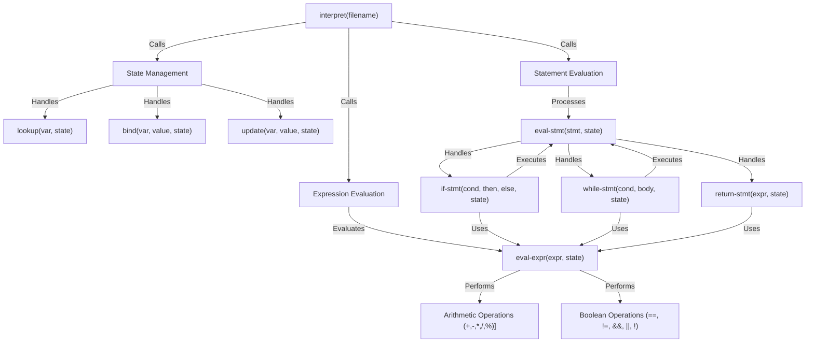

```mermaid
flowchart TD
    A["interpret(filename)"] -->|Calls| B["State Management"]
    A -->|Calls| C["Expression Evaluation"]
    A -->|Calls| D["Statement Evaluation"]
    
    B -->|Handles| B1["lookup(var, state)"]
    B -->|Handles| B2["bind(var, value, state)"]
    B -->|Handles| B3["update(var, value, state)"]
    
    C -->|Evaluates| C1["eval-expr(expr, state)"]
    C1 -->|Performs| C2["Arithmetic Operations (+,-,*,/,%)]"]
    C1 -->|Performs| C3["Boolean Operations (==, !=, &&, ||, !)"]
    
    D -->|Processes| D1["eval-stmt(stmt, state)"]
    D1 -->|Handles| D2["if-stmt(cond, then, else, state)"]
    D1 -->|Handles| D3["while-stmt(cond, body, state)"]
    D1 -->|Handles| D4["return-stmt(expr, state)"]
    
    D2 -->|Uses| C1
    D3 -->|Uses| C1
    D4 -->|Uses| C1
    
    D2 -->|Executes| D1
    D3 -->|Executes| D1

```